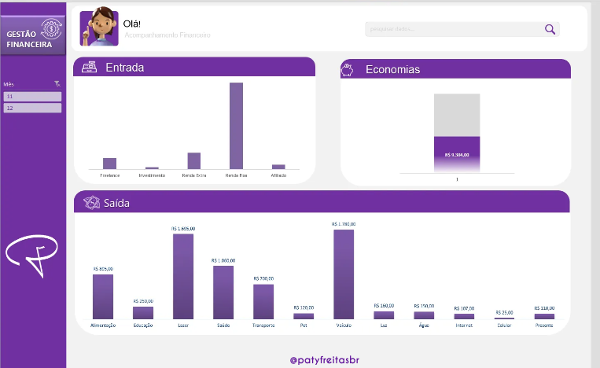

# Controle Financeiro com Insights de IA
 
[Sobre o Projeto](#sobre-o-projeto) • [Demonstração](#demostração) • [Tecnologias Utilizadas](#tecnologias-utilizadas) • [Como foi feito](#como-foi-feito) • [Funcionalidades da Planilha](#funcionalidades-da-planilha) • [Prompts Desenvolvidos e Resultados](#prompts-desenvolvidos-e-resultados) • [Insights Gerados](#insight-gerados) • [Exemplos de Aplicação da IA](#explos-de-aplicacao-da-ia) •[Referências](#referências) • [Licença](#licenca) • [Contato](#contato)


## Sobre o Projeto

Este projeto faz parte de um desafio do bootcamp de Inteligência Artificial, onde a missão foi desenvolver uma planilha de controle financeiro, implementar validação de dados e gerar insights poderosos através de IA. A ideia central é demonstrar como técnicas de IA e análise de dados podem transformar os dados objtidos através de uma planilha em uma ferramenta estratégica para decisões financeiras mais eficazes.

### Demonstração




##  Tecnologias Utilizadas 
* [Dzine](https://www.dzine.ai/?via=paty)
* [ChatGPT](https://chatgpt.com/)
* Microsoft Excel 

##  Como foi feito
* Criaçao mascote 3D da planilha com uso da IA [Dzine](https://www.dzine.ai/?via=paty): 
* Criação de Planilha para análise de dados Excel:  
* [ChatGPT](https://chatgpt.com/): Geração de dados fictícios para a planilha, geração de ideia de nome da planilha e Analise dos dados obtidos na planilha com Insights poderosos.


### Funcionalidades da Planilha

* **Cadastro de despesas e receitas**: Controle detalhado dos gastos e ganhos diários com categorias como renda, lazer, alimentação, saúde e mais.
* **Validação de dados no Excel**: Regras de validação para garantir que os dados estejam corretos e organizados.
* **Classificação por categoria e tipo de gasto** : Classificação automática dos lançamentos financeiros como entradas ou saídas, facilitando a visualização e análise.
* **Relatórios de status**: Status das despesas (pago, pendente, atrasado) para monitorar contas a vencer ou atrasadas.
* **Análise de operações bancárias**: Visualização das operações financeiras por meio de várias formas de pagamento (Pix, cartão de crédito, dinheiro, etc.).


## Prompts Desenvolvidos e Resultados

### 1. Prompt para criação do personagem usado na planilha

Criado originalmente no idioma Português Brasil, traduzido para inglês com ChatGPT

```
traduza o texto entre aspas para o idioma inglês.
```
* resultado gerado com IA chatGPT
```
a young, enterprising 3D woman with arm presenting something, fair skin
```


* Imagem obtidas com o prompt na IA [Dzine](https://www.dzine.ai/?via=paty) 


### 2. Prompt para geração de dados para a planilha

```
Você é um especialista me planilhas. Crie os dados FICTÍCIOS
para uma planilha de controle financeiro com as colunas:
Data, Tipo, Categoria, Descrição, Valor, Operação Bancária, Status

{REGRAS}

Data: dia, mês= novembro, anos = 2024
tipo: entrada e saída
Categoria: renda fixa, lazer, alimentação e complete com o que achar necessário
Descrição: Salário mensa, gasolina, lazer, alimentação, 	
Valor: R$ 	
Operação bancaria: Cartão de crédito, conta, Dinheiro, Pix, debito automático, transferência, boleto	
Status: recebido, pendente, atrasado

Mínimo: 30 linhas de dados

{Negativas}
não adicione datas inferior a novembro de 2024
```

### [ Confira os dados obtidos clicando aqui](./arquivos-criados-ia/dados-planilha-gerados-ia.md)


### 3. Prompt para geração de ideia de nomes da planilha 

```
Me liste nomes para essa planilha mencionada acima.

{Regras} 2 palavras no máximo

{Negativos}
Não adicione palavras em outros idiomas alem do pt-br
```

### 4. Prompt para obter insights sobre a planilha

Foi anexado um arquivo .xlsx com os dados da planilha junto com o prompt abaixo:

```
Como especialista, utilize a tabela de dados contida no documento, como base de conhecimento e me gere alguns insights dessa tabela de gastos. Explique de formas simples em uma linguagem humanizada

{Regras}
• Informe onde estão os maiores gastos
• As possíveis gastos que podem ser evitados
• Me dê informações que ache relevante sobre os dados contidos na planilha

{NEGATIVO}
• Não responda em nenhum idioma diferente do pt-br
```

### Insights Gerados

Com base nos dados inseridos na planilha, a IA gerou insights úteis para o usuário, tais como:

* **Maiores gastos**: Identificação das categorias com maiores valores gastos (ex.: alimentação, lazer e transporte), ajudando a visualizar onde o orçamento está mais comprometido.
* **Possíveis gastos a reduzir**: Pontos de atenção para otimizar as finanças, como custos com assinaturas automáticas, lazer e refeições em restaurantes.
* **Recomendações de economia**: Sugestões de ajustes que podem levar a uma economia significativa ao longo do tempo, como evitar compras por impulso, reduzir o uso do cartão de crédito e priorizar despesas essenciais.


### [ Confira os dados obtidos clicando aqui](./arquivos-criados-ia/insights-ia.md)


## Exemplos de Aplicação da IA

Este projeto é um exemplo prático de como a IA pode ser aplicada para:

* **Automatizar Análises**: Transformar dados de gastos em informações estratégicas.
* **Previsão e Planejamento Financeiro**: Utilizar insights de IA para prever e planejar gastos futuros.
* **Auxílio em Decisões Financeiras**: Oferecer recomendações personalizadas para melhorar a saúde financeira.


## 📌 Créditos e Referências

Este projeto foi desenvolvido como parte do desafio do Bootcamp "CCAIXA - IA Generativa com Microsoft Copilot [Dio - Digital Innovation One]( https://www.dio.me/sign-up?ref=2772EA2C589E462BB0C382518E0ACBA2) .


## Contato

👩‍💻 Patrícia Freitas

📬 brpatyfreitas@gmail.com

 <a href="https://www.linkedin.com/in/patyfreitasbr"></a>
  <a href="https://www.instagram.com/patyfreitasbr"></a>

[](https://github.com/patyfreitasbr/Google-Search-Page-Clone/blob/main/LICENSE)

<hr>

<p>Se você achou esse projeto interessante, sinta-se à vontade para dar uma ⭐ no repositório!<p>
